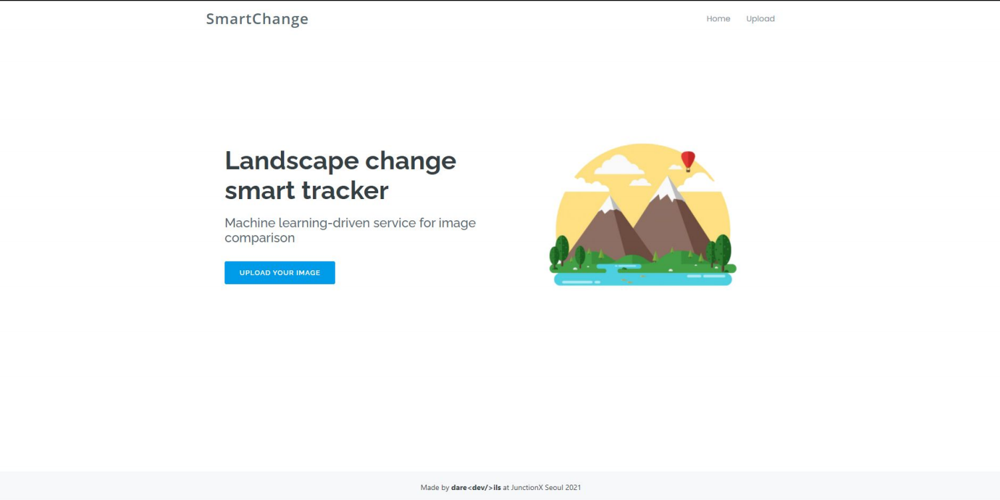

# SmartChange - JunctionX Seoul 2021

 > AI-powered web application able to track changes in urban landscape

🥉 Third winner in the **[SI Analytics](https://si-analytics.ai/eng/)** track of **[JunctionX Seoul 2021](https://junctionx-seoul-2021.oopy.io/)** Hackathon (21-23rd, May 2021)



Run frontend:
```npm start run```

Run backend:
```python app.py```

`app.py` - Flask backend

`app.unit` - package with CNN

`src` - Vue.js frontend
